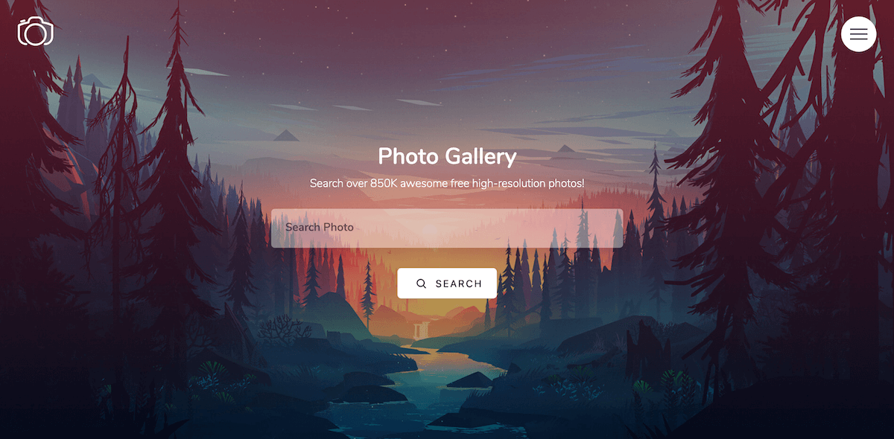

## Photo Gallery
Photo Gallery is built using [Laravel](https://laravel.com) and cosumes [Unsplash API](https://unsplash.com/developers) to search over 850K photos. some of basic features are as follows: 

**Front-end**
- On-site SEO-Friendly
- Using HTML5 markup
- Responsive mobile-friendly design
- CSS3/SASS 7-1 File Architecture
- CSS3/SASS BEM (Block Element Modifier) Pattern
- Webpack to compile assets, CSS and JavaScript pre-processors

**Back-end**
- Search photos using a keyword or phrases
- Listing 10 photos per page
- Pagination to navigate thru search result pages
- Download link for high-res photo
- Likes count for each photo
- **COMING SOON** - Photo details (exif meta-date, location, user info ... ) 
- Input validation
- Data filtering 
- Error handling

## Requirements
Since the application is using Laravel PHP framework, same Server Requirements applies here as any other Laravel application. However i have best experience using [MAMP](https://www.mamp.info/en/) to setup a fast and easy-to-use local server.

**NOTE!** Remember Laravel uses **public** directory as the root to whole project while setting it up to your local server.

## Installation
After downloading the app, open the project within **terminal** and run the following commands to install all packages and dependencies:
- **composer install**  (takes few mins to install all dependencies)
- **php artisan storage:link** (creating soft link to serve storge directory)

**NOTE!** Need to have [Composer](https://getcomposer.org/) installed on you local machine to be able to run **composer install** commmand installing dependencies.

## Configuration
You are able to use your own **Unsplash API Key** by configuring the **.env** file. however my API credentials are already set to use for 50 Free Requests/hr.

Here are some settings/variables you can change within **.env** file
- **UNSPLASH_SECRET** (already using my creds)
- **UNSPLASH_ACCESS** (already using my creds)
- **UNSPLASH_PER_PAGE** (10 photos per page as default)